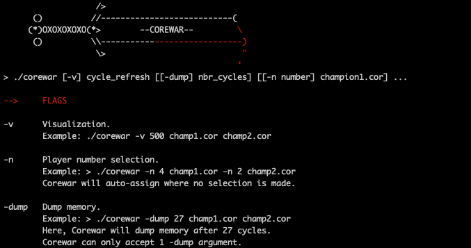

# Corewar
Fourth Algo Project @ 42 Paris.

**Project score : [125 / 100]**



Corewar is a two-part project which consists of running 'Champions' compiled into bytecode from a lightweight custom assembly code in a virtual machine: the virtual arena.
The aim of the game is for the Champions to 'fight' in a restricted envoronement, the virtual arena, a circular area of memory. Each champions must execute 'LIVE' at least once per 'CYCLE_TO_DIE' to stay in the game, while trying to corrupt the other's bytecode.
A four man team was formed for this task, with two members working on the ASM (parsing and compiling pseudo assembly language into valid bytecode) and two on creating the virtual arena (an environement to run the bytecode champions in accordance with Corewar's rules). 

## Installation

```
git clone https://github.com/andrewrzepecki/corewar && cd corewar && make

```
## ASM
This part of the project consists of parsing and compiling the champions ('.s' extension required) into valid bytecode.
**Usage**
```
./asm [options] [champion_to_compile.s]
```
The executable outputs a .cor file, which is the compiled champions in bytecode.

**Example:**


## VM
This part of the project consists of running the bytecode generated by the ASM in a virtual machine, a circular area of memory, and implementing the rules of Corewar: each champion executes it's instructions in order, and must execute 'LIVE' at least once per 'CYCLE_TO_DIE' while trying to stop the other champions from doing the same.

**Usage**

```
./corewar [-dump, -v [cycle_nb]] [-n player_nb] [champion1.cor] [-n player_nb] [champion2.cor] ...
```


